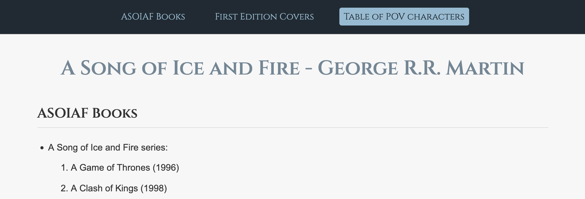
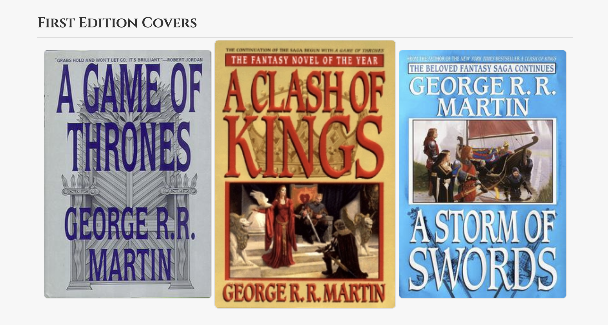

# CSS Exercises

- [Exercise 01 - Books](#ex01)
- [Exercise 02 - Form](#ex02)

## <a id="ex01"></a> Exercise 01 - Books

Style the `books.html` page as shown in the screenshots below. All the CSS should be added to the styles.css file. The screenshots were taken in Firefox at a viewport width of 1024px.

These are the accent colors used for the navbar and the main heading:

```css
:root {
  --ice-blue-juvie: #8fbcd4;
  --gothic-gray-blue: #6f8796;
  --dark-slate-infinity: #1f2a33;
}
```

Use 'Cinzel' as the custom font for the navbar and the headings.

```html
  <link href="https://fonts.googleapis.com/css2?family=Cinzel:wght@400;600&display=swap" rel="stylesheet" />
```


Make sure to implement this hover effect for the navbar.



There is also a hover effect for the images.



## <a id="ex02"></a> Exercise 02 - Form

Style the `form.html` page as shown in the screenshot below. All the CSS should be added to the styles.css file. The screenshot was taken in Firefox at a viewport width of 1024px.

The accent color is a shade of Midnight Blue (#161678). 


